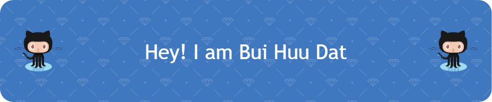

<h3 align="center">I'm a .</h3>

  

  

  

  

- 🌱 I’m currently learning **React, NodeJs**

- 👨‍💻 All of my projects are available at [Bui Huu Dat](https://buihuudat.vercel.app/)

- 💬 Ask me about **React, PHP**

- 📫 How to reach me **buihuudat.dev@gmail.com**

- ⚡ Fun fact **Handsome, lots of money are things I don't have.   But I have enthusiasm in my work.**

 
 

&nbsp;

 

 

<h3 align="left">Languages and Tools:</h3>

 

*Programming Languages*
  
 
 
 

*Frontend Development*
  
 
 
 

 
 

*Backend Development*
  

 

*Database*
  
 

  

*Mobile App Development*
  

*Data Visualization*
  
  
 
*Other*
  
 
 
 
  

<h3 align="left">Connect with me:</h3>

  

<h3 align="left">Support:</h3>

